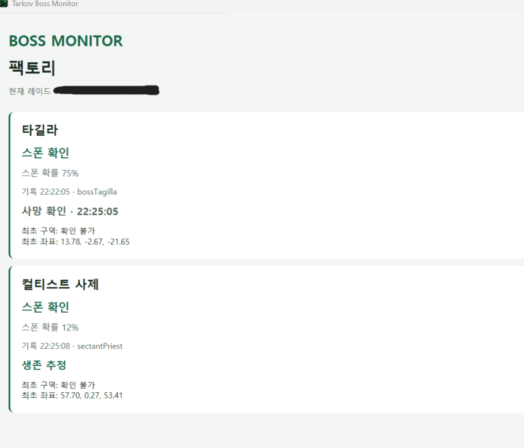

# Tarkov Boss Monitor

[한국어](README.ko.md) · [English](README.en.md) · **简体中文**

用于确认《逃离塔科夫》官方 PvE 在本机运行的战局中首领刷新的 Windows x64 应用。

## 主要功能

- 从战局日志中自动检测当前地图
- 为每张地图选择要监控的首领
- 支持在游戏运行时安装
- 通过 Windows 计划任务安全清理旧游戏日志

## 下载

[下载最新版本](https://github.com/seongjin-lab/tarkov-boss/releases/latest)

安装文件未进行代码签名，Windows SmartScreen 可能显示警告。

## 界面



## 启动器修复警告

为了获取详细的 AI 刷新日志，Tarkov Boss Monitor 会修改 `Logging.config` 中的 `aiData` 日志级别。因此，BSG Launcher 可能会将此文件识别为已修改，并显示**需要修复游戏文件**的警告。

如果出现该警告，请先让启动器完成修复，然后完全退出游戏，重新打开 Tarkov Boss Monitor 并再次应用日志设置，最后重新启动游戏。游戏更新或文件完整性检查将 `Logging.config` 恢复为原始版本后，也需要重复此流程。

## 卸载

请先完全退出《逃离塔科夫》，然后从开始菜单运行 **卸载 Tarkov Boss Monitor**，或在 **Windows 设置 → 应用 → 已安装的应用** 中卸载 Tarkov Boss Monitor。

卸载程序会删除日志清理计划任务，并将本程序修改过的 `Logging.config` 日志级别自动恢复为安装前的值。如果游戏仍在运行，或安装后日志配置已被更改，为确保安全将跳过自动恢复，并在卸载结果中显示备份位置。

## 支持范围

- 支持：在本机运行并记录详细 AI 日志的官方 PvE 战局
- 不支持：PvP、在线 PvE，以及不支持本地运行的地图
- Streets of Tarkov（塔科夫街区）等无法在本地游玩的地图不受支持
- 不保证能够判断当前位置和生存状态

## 从源代码构建

需要 Windows 10 或更高版本、.NET 8 SDK 和 Inno Setup 6。

```powershell
.\build.ps1
```

安装文件将生成在 `outputs/installer` 中。

## 许可证

本项目采用 [MIT 许可证](LICENSE)。

本工具为非官方工具，与 Battlestate Games 或 Escape from Tarkov 无关。
